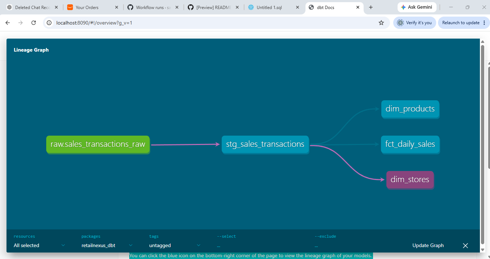

# 🏬 RetailNexus DE — Cloud-Native Retail Analytics Platform

## What Is This?

RetailNexus DE is a production-grade, end-to-end retail analytics data
platform demonstrating modern Data Engineering practices on a cloud-native
stack. It processes real-time Point-of-Sale (POS) transaction streams
through a full Bronze to Silver to Gold medallion architecture, mirroring
the business logic used in enterprise Oracle Retail systems (ReSA, RPM,
RMS) rebuilt on today's tools.

Built as a hands-on portfolio project by a data engineer transitioning
from 8+ years of Oracle Retail (ReSA/RMS/RPM) consulting into modern
cloud data engineering.

## Architecture

Kafka Producer to Kafka to PySpark Structured Streaming to S3 Bronze,
then PySpark and Delta Lake to S3 Silver (deduplicated, validated),
then Great Expectations validation, then export to Snowflake RAW,
then dbt staging and marts, then Snowflake Gold star schema.

## Tech Stack

| Layer | Technology |
|---|---|
| Streaming ingestion | Apache Kafka |
| Processing | PySpark (Structured Streaming) |
| Storage (Bronze/Silver) | AWS S3 |
| Table format | Delta Lake |
| Data quality | Great Expectations |
| Transformation (Gold) | dbt |
| Data warehouse | Snowflake |
| Orchestration | Apache Airflow |
| Infrastructure | Docker, GitHub Codespaces |
| CI/CD | GitHub Actions |

## What's Built So Far

- Phase 1 - Infrastructure: Dockerized Kafka, Zookeeper, Airflow, Postgres; CI pipeline
- Phase 2 - Ingestion: Kafka producer simulating 50 Dutch retail stores; PySpark Structured Streaming consumer writing partitioned Parquet to S3 Bronze
- Phase 3 - Transformation: Bronze to Silver with Delta Lake - deduplication, business rule validation, audit flag classification, ACID writes, time travel
- Phase 3.5 - Data Quality: Great Expectations validation suite on the Silver layer
- Phase 4 - Gold Layer: dbt + Snowflake - staging model, star schema, 14 passing tests, auto-generated lineage documentation
- Phase 5 - Orchestration: Airflow DAGs (in progress)
- Phase 6 - Serving: Dashboards + final polish (planned)

## Data Lineage

*Auto-generated by dbt — shows the dependency graph from the raw
Snowflake source through the staging model to the Gold star schema
(fct_daily_sales, dim_stores, dim_products).*

## Business Logic - ReSA Sales Audit, Modernized

| ReSA (Oracle Retail) | RetailNexus DE |
|---|---|
| RTLOG transaction capture | Kafka producer + Bronze ingestion |
| Transaction validation | PySpark business rules (Silver) |
| Duplicate transaction rejection | Window-function deduplication |
| Audit exception flagging | audit_flag classification |
| Daily audit summary reports | fct_daily_sales dbt model |
| Data quality checks | Great Expectations + dbt tests |

## About

Built by Sanjana Kulenavar - Senior Consultant transitioning from
Oracle Retail (ReSA/RMS/RPM) into Data Engineering, targeting roles
in the Netherlands.
